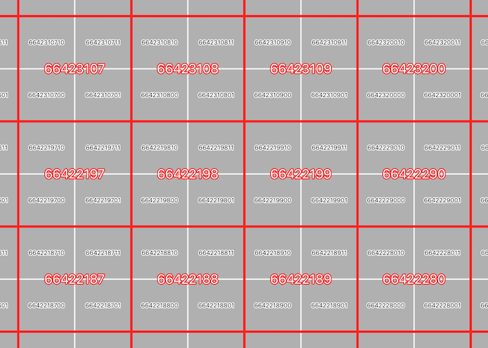
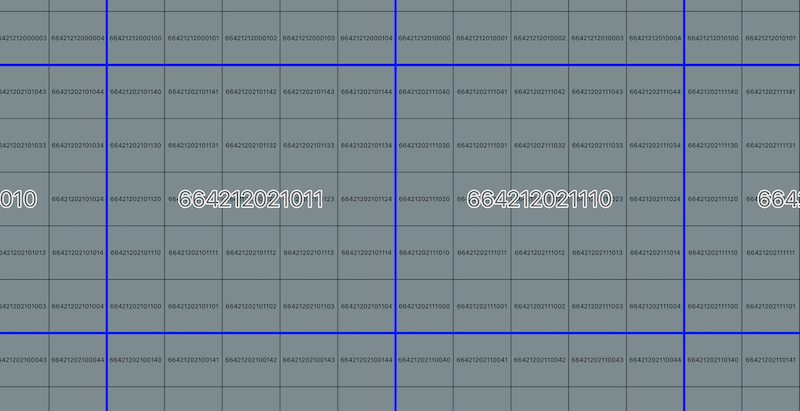

# japan-mesh-tool

日本の標準地域メッシュを生成するツール

<!-- TOC -->
- [環境構築(poetry)](#環境構築(poetry))
- [実行環境](#実行環境)
- [使い方](#使い方)
  - [出力形式](#出力形式)
- [Pythonモジュールとして](#pythonモジュールとして)
- [対応メッシュ次数](#対応メッシュ次数)
  - [標準地域メッシュ](#標準地域メッシュ)
  - [分割地域メッシュ](#分割地域メッシュ)
  - [その他地域メッシュ](#その他地域メッシュ)
  - [メッシュ番号の割り振りについて](#メッシュ番号の割り振りについて)
- [テスト](#テスト)
  - [バイナリ](#バイナリ)
  - [コマンド例](#コマンド例)

<!-- /TOC -->

## 環境構築(poetry)

- poetryをインストール

```
pip3 install poetry
```

- 個別の環境で、poetryの仮想環境を動かすようにするには(任意)

```
poetry config virtualenvs.in-project true
```

- 当プロジェクトへpoetryをインストール

```
poetry install
```

## 実行環境

- Python3.8で開発
- メインスクリプトは./src/japanmesh/main.py
- ./src/japanmeshをPythonモジュールとして使用可能

## 使い方

### 出力形式

- 行区切りGeoJSON、いわゆるgeojsonl形式（=GeoJsonSeq形式）で出力
- 出力例：./sample/mesh_5.geojsonl

```
poetry run python src/japanmesh/main.py <meshnum:メッシュ次数> <-e:領域指定、"カンマ区切り左下経緯度 カンマ区切り右上経緯度"形式で指定> <-d:保存先>
```

- 領域指定(-e),保存先(-d)はオプションです
  - 保存先を指定しない場合スクリプト実行ディレクトリに保存します
  - 領域を指定しない場合最大範囲で生成します。3次以上はメッシュ数が膨大なので、大きな領域にすべきではありません

#### コマンド例

```
poetry run python ./src/japanmesh/main.py 5 -e 142.2,44.0 142.3,44.5 -d ./
```

4次メッシュ以上は別称で指定する事が出来ます

```
poetry run python src/japanmesh/main.py 250m -e 142.2,44.0 142.3,44.5 -d ./
```

全国分の1次メッシュをカレントディレクトリに出力する場合

```
poetry run python src/japanmesh/main.py 1
```

## Pythonモジュールとして

- ./src/japanmesh自体をPythonモジュールとしてimport可能です
- その場合、get_meshes()関数のみを使用可能です
  - (./src/sample.pyを参照)

## 対応メッシュ次数

### 標準地域メッシュ

|  メッシュ番号  |  別称  |  詳細  |  メッシュコード  |
| ---- | ---- | ---- | ---- |
|  1  |  -  |  80kmメッシュ |  4桁  |
|  2  |  -  |  10kmメッシュ |  6桁  |
|  3  |  -  |  1kmメッシュ  |  8桁  |

### 分割地域メッシュ

3次メッシュを基準し、任意の回数4分割して得られるメッシュ

|  メッシュ番号  |  別称  |  詳細  |  メッシュコード  |
| ---- | ---- | ---- | ---- |
|  3  |  -  |  1kmメッシュ  |  8桁  |
|  4  |  500m  |  500mメッシュ |  9桁  |
|  5  |  250m  |  250mメッシュ |  10桁  |
|  6  |  125m  |  125mメッシュ |  11桁  |

### その他地域メッシュ

3次メッシュを基準とし、上位メッシュを任意の数に分割して得られるメッシュ

|  メッシュ番号  |  別称  |  詳細  |  メッシュコード  |  備考  |
| ---- | ---- | ---- | ---- | ---- |
|  3  |  -  |  1kmメッシュ  |  8桁  |  -  |
|  7  |  100m  |  100mメッシュ |  10桁  |  1kmメッシュをタテヨコ10分割  |
|  8  |  50m  |  50mメッシュ  |  12桁  |  100mメッシュをタテヨコ2分割  |
|  9  |  10m  |  10mメッシュ  |  12桁  |  100mメッシュをタテヨコ10分割  |
|  10  |  5m  |  5mメッシュ  |  14桁  |  10mメッシュをタテヨコ2分割  |

### メッシュ番号の割り振りについて

#### 1~3:標準地域メッシュ

- 一般に普及しているメッシュコード規則と同様です（以下の資料に基づき割り振ります）

- 参考1: <https://www.stat.go.jp/data/mesh/pdf/gaiyo1.pdf>

- 参考2: <https://www.e-stat.go.jp/pdf/gis/chiiki_mesh_toukei.pdf>

#### 4~6:分割地域メッシュ

- JIS規格にしたがい、上位要素を4分割した左下を1,右下を2,左上を3,右上を4とします

- 参考（JIS規格番号JISX0410）：<https://www.jisc.go.jp/app/jis/general/GnrJISSearch.html>

参考画像：3次メッシュ、4次メッシュ、5次メッシュ



#### 7~:その他地域メッシュ

- 上位要素に対しメッシュ番号が2桁付加されます
- 左下を00とし、上に進むと10、20、30…、右に進むと01、02、03…と割り振ります

参考画像：100mメッシュ、10mメッシュ



## テスト

./srcディレクトリで以下のコマンドでテスト実行

```shell
poetry run python -m unittest discover tests
```
