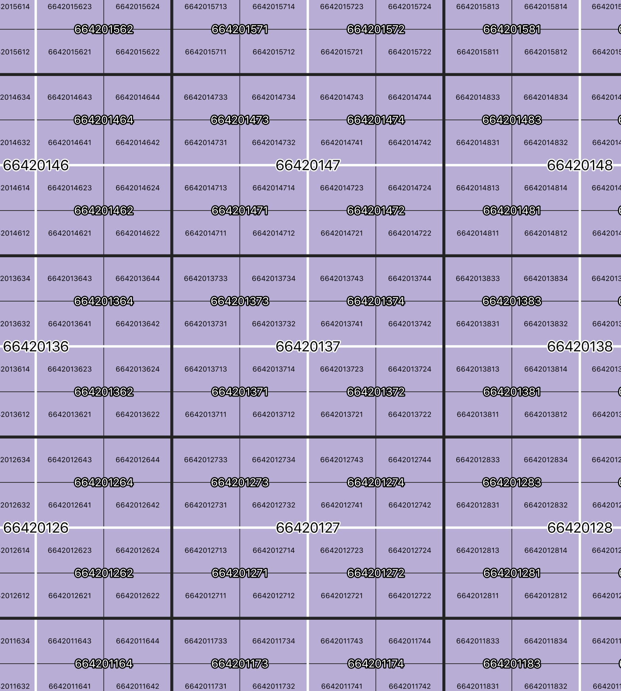

# japan-mesh-tool

日本の標準地域メッシュを生成するツール

<!-- TOC -->

- [実行環境](#実行環境)
    - [Python版](#python版)
    - [バイナリ版(Rust, experimental)](#バイナリ版rust-experimental)
- [使い方](#使い方)
    - [出力形式](#出力形式)
    - [Python版](#python版-1)
    - [バイナリ版](#バイナリ版)
- [Pythonモジュールとして](#pythonモジュールとして)
- [対応メッシュ次数](#対応メッシュ次数)
    - [4次以降のメッシュ番号割り振りについて](#4次以降のメッシュ番号割り振りについて)
- [テスト](#テスト)
    - [Python版](#python版-2)
    - [Rust版](#rust版)

<!-- /TOC -->

## 実行環境

### Python版
- Python3.8で開発
- メインスクリプトは./python/japanmesh/main.py
- ./python/japanmeshをPythonモジュールとして使用可能

### バイナリ版(Rust, experimental)
- macOS向けは./rust/japan-mesh
- Windows向けは./rust/japan-mesh.exe
    - いずれも64bit向け

## 使い方

### 出力形式

- 行区切りGeoJSON、いわゆるgeojsonl形式（=GeoJsonSeq形式）で出力
- 出力例：./sample/mesh_5.geojsonl

### Python版

```
python main.py <meshnum:メッシュ次数> <-e:領域指定、"カンマ区切り経緯度 カンマ区切り経緯度"形式で指定> <-d:保存先>
```

- 領域指定(-e),保存先(-d)はオプションです
    - 保存先を指定しない場合スクリプト実行ディレクトリに保存します
    - 領域を指定しない場合最大範囲で生成します。3次以上はメッシュ数が膨大なので、大きな領域にすべきではありません


#### コマンド例

```
python main.py 5 -e 142.2,44.0 142.3,44.5 -d ./
```

4次メッシュ以上は別称で指定する事が出来ます
```
python main.py 250 -e 142.2,44.0 142.3,44.5 -d ./
```

全国分の1次メッシュをカレントディレクトリに出力する場合
```
python main.py 1
```

### バイナリ版

Windows環境の場合、japanmeshをjapanmesh.exeに読み替えてください。

```
./japanmesh <meshnum:メッシュ次数> <カンマ区切り左下経緯度> <カンマ区切り右上経緯度>
```

- Rust版は、常にスクリプト実行時のカレントディレクトリにgeojsonlファイルを保存します


#### コマンド例

```
./japanmesh 5 142.2,44.0 142.3,44.5
```

4次メッシュ以上は別称で指定する事が出来ます
```
./japanmesh 250 142.2,44.0 142.3,44.5
```

全国分の2次メッシュをカレントディレクトリに出力する場合
```
./japanmesh 2
```

## Pythonモジュールとして

- ./python/japanmesh自体をPythonモジュールとしてimport可能です
- その場合、get_meshes()関数のみを使用可能です
    - (./python/sample.pyを参照)


## 対応メッシュ次数

|  次数  |  別称  |  詳細  |  メッシュコード  |
| ---- | ---- | ---- | ---- |
|  1  |  -  |  80kmメッシュ |  4桁  |
|  2  |  -  |  10kmメッシュ |  6桁  |
|  3  |  -  |  1kmメッシュ  |  8桁  |
|  4  |  500  |  500mメッシュ |  10桁  |
|  5  |  250  |  250mメッシュ |  12桁  |
|  6  |  125  |  125mメッシュ |  14桁  |
|  7  |  50  |  50mメッシュ  |  14桁  |

参考1: https://www.stat.go.jp/data/mesh/pdf/gaiyo1.pdf

参考2: https://www.e-stat.go.jp/pdf/gis/chiiki_mesh_toukei.pdf

### 4次以降のメッシュ番号割り振りについて
4次、5次、6次（ないし7次）と細かくなるに従い、メッシュ番号が2桁ずつ付加されます。
4次以降は番号の割り振りに一般的なルールがありませんが、2,3次メッシュと同じ考え方で割り振りします。

#### 参考画像


※赤枠が3次メッシュ、白枠が4次メッシュ

## テスト

### Python版
./pythonディレクトリで以下のコマンドでテスト実行

```shell
python -m unittest discover tests
```

### Rust版
未実装