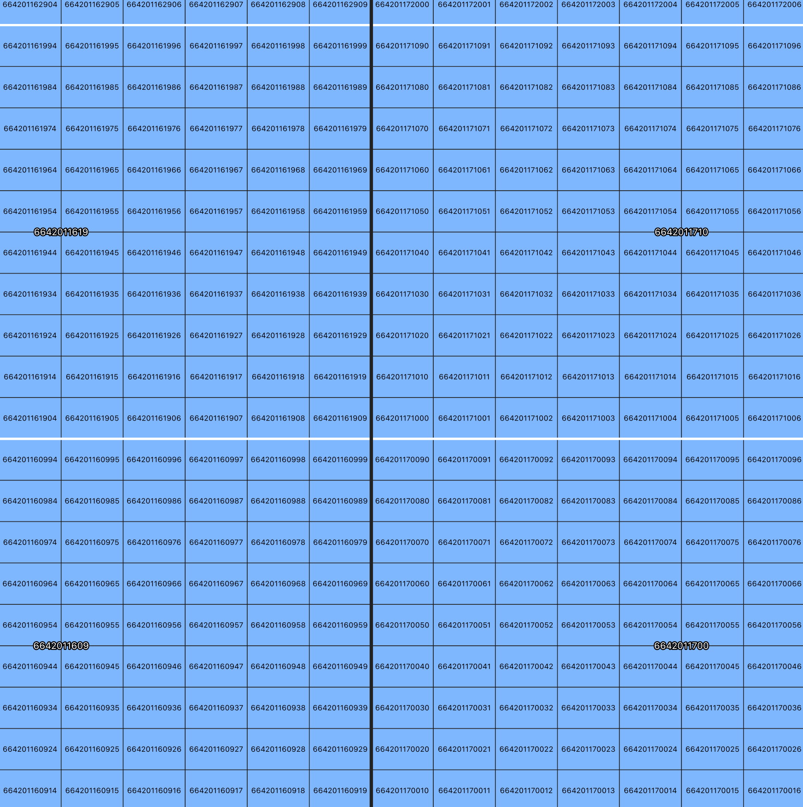

# japan-mesh-tool

日本の標準地域メッシュを生成するツール

<!-- TOC -->

- [実行環境](#実行環境)
    - [Python版](#python版)
    - [バイナリ版(Rust, experimental)](#バイナリ版rust-experimental)
- [使い方](#使い方)
    - [出力形式](#出力形式)
    - [Python版](#python版-1)
    - [バイナリ版](#バイナリ版)
- [Pythonモジュールとして](#pythonモジュールとして)
- [対応メッシュ次数](#対応メッシュ次数)
    - [標準地域メッシュ](#標準地域メッシュ)
    - [分割地域メッシュ](#分割地域メッシュ)
    - [その他地域メッシュ](#その他地域メッシュ)
    - [4次以降のメッシュ番号割り振りについて](#4次以降のメッシュ番号割り振りについて)
- [テスト](#テスト)
    - [Python版](#python版-2)
    - [Rust版](#rust版)

<!-- /TOC -->

## 実行環境

### Python版
- Python3.8で開発
- メインスクリプトは./python/japanmesh/main.py
- ./python/japanmeshをPythonモジュールとして使用可能

### バイナリ版(Rust, experimental)
- macOS向けは./rust/japanmesh
- Windows向けは./rust/japanmesh.exe
    - いずれも64bit向け

## 使い方

### 出力形式

- 行区切りGeoJSON、いわゆるgeojsonl形式（=GeoJsonSeq形式）で出力
- 出力例：./sample/mesh_5.geojsonl

### Python版

```
python python/japanmesh/main.py <meshnum:メッシュ次数> <-e:領域指定、"カンマ区切り左下経緯度 カンマ区切り右上経緯度"形式で指定> <-d:保存先>
```

- 領域指定(-e),保存先(-d)はオプションです
    - 保存先を指定しない場合スクリプト実行ディレクトリに保存します
    - 領域を指定しない場合最大範囲で生成します。3次以上はメッシュ数が膨大なので、大きな領域にすべきではありません


#### コマンド例

```
python python/japanmesh/main.py 5 -e 142.2,44.0 142.3,44.5 -d ./
```

4次メッシュ以上は別称で指定する事が出来ます
```
python python/japanmesh/main.py 250 -e 142.2,44.0 142.3,44.5 -d ./
```

全国分の1次メッシュをカレントディレクトリに出力する場合
```
python python/japanmesh/main.py 1
```

### バイナリ版

Windows環境の場合、japanmeshをjapanmesh.exeに読み替えてください。

```
rust/japanmesh <meshnum:メッシュ次数> <カンマ区切り左下経緯度> <カンマ区切り右上経緯度>
```

- Rust版は、常にスクリプト実行時のカレントディレクトリにgeojsonlファイルを保存します


#### コマンド例

```
rust/japanmesh 5 142.2,44.0 142.3,44.5
```

4次メッシュ以上は別称で指定する事が出来ます
```
rust/japanmesh 250 142.2,44.0 142.3,44.5
```

全国分の2次メッシュをカレントディレクトリに出力する場合
```
rust/japanmesh 2
```

## Pythonモジュールとして

- ./python/japanmesh自体をPythonモジュールとしてimport可能です
- その場合、get_meshes()関数のみを使用可能です
    - (./python/sample.pyを参照)


## 対応メッシュ次数

### 標準地域メッシュ

|  メッシュ番号  |  別称  |  詳細  |  メッシュコード  |
| ---- | ---- | ---- | ---- |
|  1  |  -  |  80kmメッシュ |  4桁  |
|  2  |  -  |  10kmメッシュ |  6桁  |
|  3  |  -  |  1kmメッシュ  |  8桁  |

### 分割地域メッシュ

3次メッシュを基準し、任意の回数4分割して得られるメッシュ

|  メッシュ番号  |  別称  |  詳細  |  メッシュコード  |
| ---- | ---- | ---- | ---- |
|  3  |  -  |  1kmメッシュ  |  8桁  |
|  4  |  500  |  500mメッシュ |  9桁  |
|  5  |  250  |  250mメッシュ |  10桁  |
|  6  |  125  |  125mメッシュ |  11桁  |

### その他地域メッシュ

3次メッシュを基準とし、上位メッシュを任意の数に分割して得られるメッシュ

|  メッシュ番号  |  別称  |  詳細  |  メッシュコード  |  備考  |
| ---- | ---- | ---- | ---- | ---- |
|  3  |  -  |  1kmメッシュ  |  8桁  |  -  |
|  7  |  100  |  100mメッシュ |  10桁  |  1kmメッシュをタテヨコ10分割  |
|  8  |  50  |  50mメッシュ  |  12桁  |  100mメッシュをタテヨコ2分割  |
|  9  |  10  |  10mメッシュ  |  12桁  |  100mメッシュをタテヨコ10分割  |


### 4次以降のメッシュ番号割り振りについて

#### 1~3:標準地域メッシュ

- 一般に普及しているメッシュコード規則と同様です（以下の資料に基づき割り振ります）

- 参考1: https://www.stat.go.jp/data/mesh/pdf/gaiyo1.pdf

- 参考2: https://www.e-stat.go.jp/pdf/gis/chiiki_mesh_toukei.pdf

#### 4~6:分割地域メッシュ

- JIS規格にしたがい、上位要素を4分割した左下を1,右下を2,左上を3,右上を4とします

- 参考（JIS規格番号JISX0410）：<https://www.jisc.go.jp/app/jis/general/GnrJISSearch.html>


参考画像：黒枠が3次メッシュ、白枠が4次メッシュ、紫が5次メッシュ


#### 7~9:その他地域メッシュ

- 上位要素に対しメッシュ番号が2桁付加されます
- 左下を00とし、上に進むと10、20、30…、右に進むと01、02、03…と割り振ります

参考画像：黒枠が3次メッシュ（1kmメッシュ）、白枠が100mメッシュ、水色が10mメッシュ



## テスト

### Python版
./pythonディレクトリで以下のコマンドでテスト実行

```shell
python -m unittest discover tests
```

### Rust版
未実装